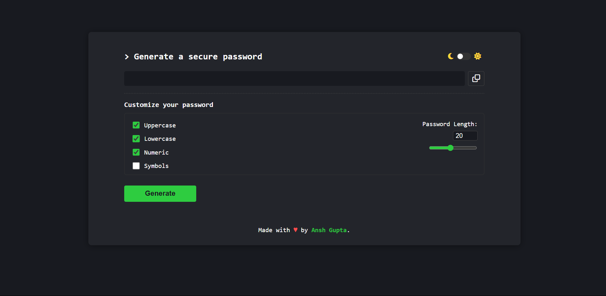

# Password Generator

A modern, customizable password generator web app to help you create secure passwords with ease. Built with HTML, CSS, and JavaScript.

## Features

- Generate strong, random passwords instantly
- Customize password length (4-40 characters)
- Choose character types: Uppercase, Lowercase, Numbers, Symbols
- Copy generated password to clipboard with one click
- Responsive, user-friendly interface
- Light/Dark theme toggle

## Demo

 

[Live Demo](https://password-generator-by-ansh.netlify.app/)

## Getting Started

### 1. Clone the repository
```bash
git clone https://github.com/your-username/password-generator.git
cd password-generator
```

### 2. Open the app
Simply open `index.html` in your web browser. No installation or build steps required.

## Usage
1. Select the desired password options (length, character types).
2. Click the **Generate** button to create a new password.
3. Click the **Copy** button to copy the password to your clipboard.
4. Use the theme toggle to switch between light and dark modes.

## File Structure
```
Password Generator/
  ├── index.html      # Main HTML file
  ├── style.css       # Stylesheet
  ├── script.js       # JavaScript logic
  └── README.md       # Project documentation
```

## Credits
- Made with ♥ by [Ansh Gupta](#)
- [Font Awesome](https://fontawesome.com/) for icons

## License
This project is licensed under the MIT License. 